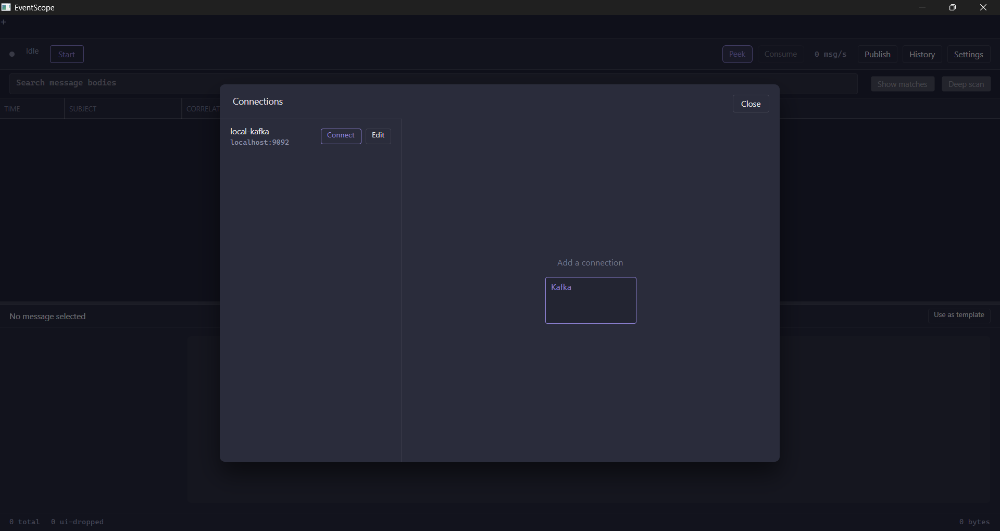
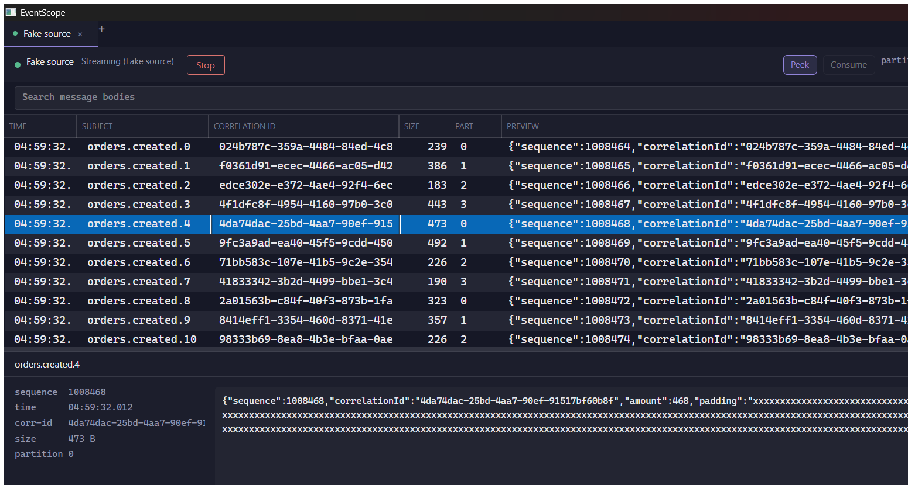
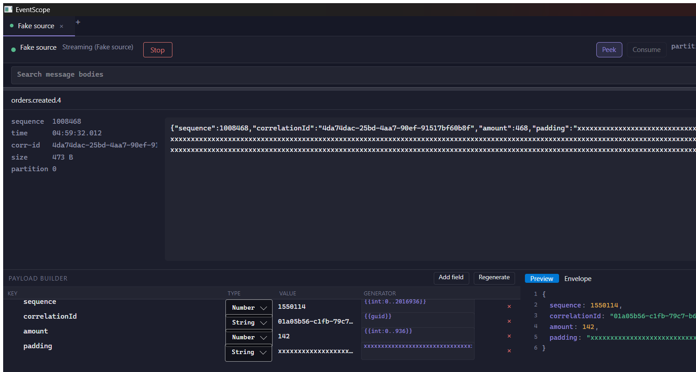

# EventScope

A cloud-agnostic event publisher and subscriber for Windows. One desktop tool for
inspecting and producing messages across **Apache/Confluent Kafka**, **Azure Service Bus**
and **AWS SQS**, without switching between three vendor consoles.

> **Status: alpha, under active development.** Kafka works end to end — consume, persist,
> search, and publish back, all through a real UI with no environment variables required.
> Azure Service Bus and AWS SQS are not implemented yet (both are stubbed projects, tracked
> as milestone M4). A prebuilt Windows binary is on the
> [latest release](../../releases/latest) page, and
> [`Docs/PROGRESS.md`](Docs/PROGRESS.md) has the full, honestly-kept status — including what
> currently falls short of its own acceptance criteria.
>
> Try it with no broker at all: `dotnet run --project src/EventScope.App`, close the
> connection dialog, and click **Start** to stream a synthetic feed. That built-in **Fake
> source** is a development affordance — it is present in Debug builds (which is what
> `dotnet run` gives you) and hidden in the released binary, where a stream of invented
> traffic would just be confusing. Set `EVENTSCOPE_FAKE_SOURCE=1` to bring it back in a
> Release build.
>
> For real work, open that same dialog and add a Kafka connection.

## What it does today

- **Real Kafka, no config files or env vars.** Add a broker from the connection manager,
  test it (a real `AdminClient` metadata probe, not a ping), save it, and connect — the app
  remembers it for next time. A saved connection's password is DPAPI-protected at rest.
- **Non-destructive by default.** Every Kafka connection here uses a fresh, throwaway
  consumer group with auto-commit disabled, so running this tool never disturbs a real
  consumer group's offsets or lag. SQS (once M4 lands) cannot peek without consuming, and
  the UI will say so permanently rather than hiding it.
- **Everything is kept, and you can go back to it.** Messages stream to a local append-only log
  (LZ4-compressed segments) with a SQLite index, day-file rolling, and capped retention with
  eviction. Reopen the app and **History** browses every capture still on disk — pick a day, scroll
  it, read any message body — with no connection running and nothing sent to the broker.
- **Start where you want, not just from now.** A connection can begin at the latest offset (the
  default: tail from now), the earliest the topic still retains, a timestamp, or an explicit offset
  on a chosen partition — so the messages that arrived before you opened the tool are not lost to
  you. Still non-destructive: the throwaway group and disabled auto-commit mean reading a backlog
  never touches a real consumer group.
- **Search that works on volume.** Instant filtering of what is already on screen, full-text
  search over message bodies (FTS5), and a cancellable deep scan that reads every body on disk
  with live progress — for the things an index structurally cannot answer: a term past the
  indexed prefix, or anything at all while the index is still catching up. Trigram infix search
  on message and correlation IDs is built and tested but not yet reachable from the search bar;
  it needs the scope selector that is still on the polish list.
- **Bounded by design.** A byte-budgeted ingest path, a configurable on-disk cap with
  eviction, and a message grid that never materializes more rows than are on screen — this
  is the actual point of the project, not an afterthought.
- **A publisher, not just a viewer.** Take a consumed message, turn it into a template with
  generated fields (`{{guid}}`, `{{now:iso}}`, `{{int:1..100}}`, `{{ref:$.path}}` — with
  cycle detection), and publish or burst it back to the same broker.

### Broker support

| Broker | Status |
|---|---|
| Apache / Confluent Kafka | Done — consume, publish, partition targeting, connection testing |
| Azure Service Bus | Not started (M4) |
| AWS SQS | Not started (M4) |

## Screenshots

<table>
<tr><td width="50%">

**Connection manager** — add, test, and connect to a real Kafka broker with no config files.



</td><td width="50%">

**Consumer view** — a selected row's full body in the detail pane, streaming at 10k msg/s.



</td></tr>
<tr><td colspan="2">

**Publisher** — "Use as template" schema-infers generators from a consumed message
(`{{int:0..2016936}}`, `{{guid}}`, …), live JSON preview, publish or burst.



</td></tr>
</table>

## Install

### Via Scoop (recommended)

```powershell
scoop bucket add EventScope https://github.com/sinh-r/scoop-EventScope
scoop install EventScope
```

Scoop downloads through its own client rather than a browser, so the file never gets
Mark-of-the-Web attached and the SmartScreen prompt below never appears. Scoop also verifies
the release's SHA256 on every install, which is a real integrity check rather than a dismissed
dialog.

### Direct download

Grab `EventScope.exe` from the [latest release](../../releases/latest). It is a single
self-contained file — no installer, and no .NET runtime needed on the machine you run it on.

Windows will warn that it "isn't commonly downloaded" (see below for why), so unblock it once
after downloading:

```powershell
Unblock-File .\EventScope.exe
```

Every release publishes `EventScope.exe.sha256` next to the binary. To check the download
before running it:

```powershell
(Get-FileHash .\EventScope.exe -Algorithm SHA256).Hash -eq (Get-Content .\EventScope.exe.sha256).Trim()
```

EventScope keeps everything it writes in `%LOCALAPPDATA%\EventScope` — settings, saved
connections and captured sessions. Nothing is written next to the executable, so updating in
place never loses them; uninstalling never removes them either.

## Build from source

Requires the [.NET 10 SDK](https://dotnet.microsoft.com/download) (the exact version is
pinned in `global.json`).

```
git clone https://github.com/rsrishabh007/EventScope.git
cd EventScope
dotnet build EventScope.slnx
./build/Run-Tests.ps1
```

Tests are run through `build/Run-Tests.ps1`, not `dotnet test`. On the current toolchain
(xunit.v3 4.0.0 / Microsoft.Testing.Platform 2.3.3 / .NET SDK 10.0.400) `dotnet test`
reports "Zero tests ran" for every assembly even though the tests pass; the script runs the
xUnit v3 test executables directly, which is the framework's native execution model. Its
header documents the problem in full.

To produce the single-file executable:

```
dotnet publish src/EventScope.App/EventScope.App.csproj -c Release ^
  -r win-x64 --self-contained ^
  -p:PublishSingleFile=true ^
  -p:IncludeNativeLibrariesForSelfExtract=true ^
  -o publish
```

That writes a self-contained `publish/EventScope.exe`. It is large (~130 MB) because it
bundles the .NET runtime, Avalonia, and the native Kafka and SQLite libraries. Trimming and
AOT are deliberately disabled — the broker SDKs are reflection-heavy and break under both.

Broker integration tests are opt-in and skipped unless the matching environment variable is
set (`EVENTSCOPE_KAFKA_BOOTSTRAP` and friends), so the suite runs with no broker available.

## Why does Windows warn about this?

Downloading `EventScope.exe` in a browser gets you *"EventScope.exe isn't commonly
downloaded. Make sure you trust EventScope.exe before you open it."*

**That is a reputation verdict, not a malware verdict.** SmartScreen has two ways to vouch
for a file — the publisher's code signature, or how many people have downloaded that exact
file — and a new release of an unsigned binary has neither. Nothing was detected; SmartScreen
simply has no basis to reassure you, and says so. To proceed anyway: **More info** → **Run
anyway**, or right-click the file → **Properties** → **Unblock**, or `Unblock-File
.\EventScope.exe`.

Two things that are worth more than clicking through that dialog:

- **Install via Scoop** (see [Install](#install)) — no Mark-of-the-Web, so no prompt at all.
- **Verify the build provenance.** Every release is built by GitHub Actions from this
  repository and carries an attestation proving which workflow, commit and tag produced it —
  a stronger guarantee than an unverified signature:

  ```powershell
  gh attestation verify .\EventScope.exe --repo sinh-r/EventPublisherConsumer
  ```

Reporting the file via `feedback.smartscreen.microsoft.com` is not worth your time: that
process works per file hash, and every release is a new hash, so any reputation earned resets
at the next version.

The real fix is code signing, through the [SignPath Foundation](https://signpath.org/)
open-source programme — free OV-level certificates for open-source projects, verified against
the public repository. The release workflow is already wired for it: the signing step is
present and stays inert until the API token exists, so approval takes effect without a
workflow change. See [`Docs/SIGNPATH_APPLICATION.md`](Docs/SIGNPATH_APPLICATION.md) for the
eligibility assessment and what is submitted. Note that even once signed, trust accrues to the
certificate over time rather than arriving instantly.

## Documentation

| Document | What it covers |
|---|---|
| [`Docs/PROGRESS.md`](Docs/PROGRESS.md) | Live status — what is done, what is next, what is blocked, and every measurement and correction found while building it |
| [`Docs/eventscope-build-plan.md`](Docs/eventscope-build-plan.md) | Authoritative architecture and build order |
| [`Docs/eventscope-implementation-plan.md`](Docs/eventscope-implementation-plan.md) | Milestones, schema, acceptance criteria |
| [`Docs/eventscope-ui-spec.md`](Docs/eventscope-ui-spec.md) | Screen inventory and interaction behaviour |
| [`Docs/DISTRIBUTION_PLAN.md`](Docs/DISTRIBUTION_PLAN.md) | Release, packaging and code-signing plan |

## Contributing

See [CONTRIBUTING.md](CONTRIBUTING.md). The project is early and the architecture is still
settling, so please open an issue before starting anything substantial.

## License

[MIT](LICENSE).
